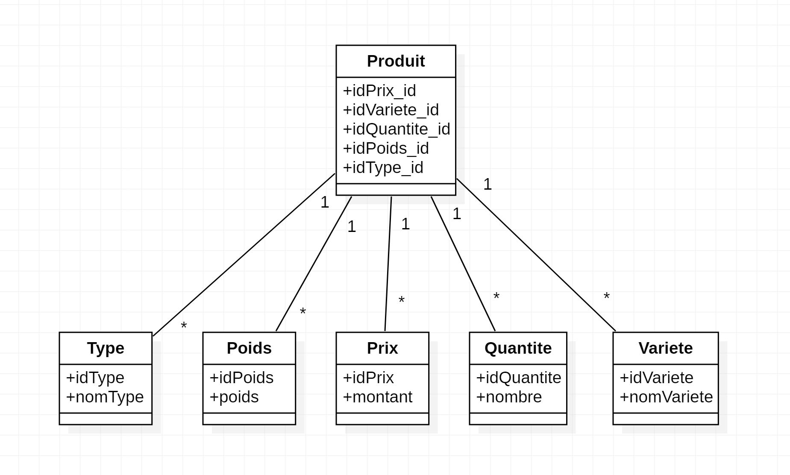

# Projet libre
## Contexte
L'entreprise X souhaite avoir une solution applicative pour pouvoir gérer son stock, sa chiffre d'affaires à la journée et qui lui permette de faire ses comptes tous les jours. Elle aimerait aussi pouvoir sortir des factures et envoyer des reçus par mail. 

## Sommaire
- Base de données
- Maquettes

## Idées
- techno: Tailwind? Bootstrap? 
- design: simple
- couleurs: blanc, gris foncé, vert
- pages: form de remplissage bdd, vente, closing fin de journée (feuille de vente journalière + form CB & espèces), générateur de facture

#### Questions?
Le panier final doit-il être dans stocker dans la bdd? 
Comment faire la partie closing sinon? 

- faire une liste pour collecter le panier et faire le closing à partir de celle-ci

## Base de données
Diagramme de classe représentant la base de données sur la gestion du stock. 

## Maquettes